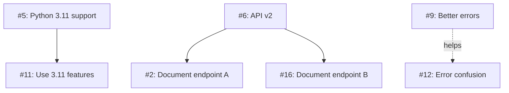
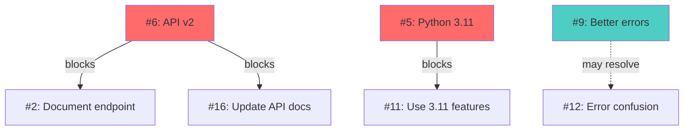

# Task 3.2: Finding Duplicates and Relationships with GitHub Copilot

**Duration:** 15 minutes
**Difficulty:** Intermediate
**GitHub Copilot Features:** @github for issue analysis, @workspace for files, semantic similarity analysis, pattern recognition

## Objective

Use GitHub Copilot to identify duplicate issues, find related issues that should be linked or solved together, and detect conflicting requests that need discussion—saving hours of manual comparison.

## Context

In a backlog of issues, manually finding duplicates and relationships requires:
- Reading each issue multiple times
- Remembering details from earlier issues
- Comparing symptoms, requests, and contexts
- Tracking relationships in your head

This could take 2-3 hours manually. GitHub Copilot can compare all issues simultaneously, identifying:
- Exact duplicates (same problem, different reporters)
- Related issues (different aspects of same underlying problem)
- Conflicting requests (users want opposite things)
- Issues that should be solved together
- Common root causes

## Setup

1. **Have your issue-analysis.md open** from Task 3.1

2. **Open Copilot Chat:** `Ctrl+Shift+I` (Cmd+Shift+I on Mac)

3. **Access to issues:**
   ```bash
   cd scenario-3-backlog-battle/issues
   ```

## Tasks

### 1. Find Exact Duplicates

**GitHub Copilot Chat Prompt:**

```
@github Analyze all issues with the quest-sample label to find exact duplicates.

Look for issues that:
1. Report the same problem
2. Request the same feature
3. Ask the same question
4. Have essentially identical content (even if worded differently)

For each duplicate set:
1. List all issue numbers involved
2. Explain why they're duplicates
3. Identify which issue should be the "primary" one (most detailed/complete)
4. Recommend which issues to close as duplicates
5. Draft a closing comment for the duplicate issues

Focus on semantic similarity, not just exact word matches. If two issues describe the same problem in different words, they're duplicates.
```

**What Copilot Does:**
- Compares all issues semantically
- Identifies same problems with different wording
- Determines most complete issue
- Drafts diplomatic closing comments

**Example Prompt for Specific Comparison:**

```
@github Are issues #1 and #13 duplicates? Compare their descriptions and determine if they're reporting the same problem.
```

**Deliverable:** Create `issue-relationships.md` with "Exact Duplicates" section

---

### 2. Identify Related Issues

**GitHub Copilot Chat Prompt:**

```
@github Find groups of related issues that aren't exact duplicates but are connected.

Look for issues that:
1. Share the same root cause (different symptoms, same underlying problem)
2. Affect the same component or feature
3. Could be solved by the same fix
4. Should be worked on together
5. Should reference each other

For each related group:
1. List issue numbers
2. Explain the relationship
3. Describe the common thread
4. Suggest whether to:
   - Create an epic/parent issue combining them
   - Link them with "related to" references
   - Solve them together in one PR
   - Keep separate but coordinate timing
5. Estimate effort if solved together vs separately

Present as groups with clear relationships.
```

**What Copilot Does:**
- Finds issues with common themes
- Identifies shared root causes
- Groups by component/feature
- Recommends coordination strategies

**Example Output Structure:**

```markdown
### Related Group 1: Windows Installation Issues

**Issues:** #3, #7, #15, #19

**Relationship:** All report installation failures on Windows due to path handling

**Common Thread:**
- Windows path separators (backslash vs forward slash)
- PowerShell vs CMD differences
- Missing Windows-specific instructions

**Root Cause:** Code doesn't properly handle Windows paths

**Recommendation:**
- Create epic issue: "Fix Windows installation experience"
- Solve all together in one comprehensive fix
- Estimated effort: 5 days together vs 8 days separately (40% savings)

**Benefits of solving together:**
- Single root cause fix addresses all
- Comprehensive testing on Windows
- Better documentation
- More efficient use of time
```

**Deliverable:** Add "Related Issue Groups" section

---

### 3. Detect Conflicting Requests

**GitHub Copilot Chat Prompt:**

```
@github Identify issues that conflict with each other—where users are requesting opposite or incompatible things.

Look for:
1. Feature requests that contradict each other
2. Issues wanting to add/remove the same feature
3. Requests for incompatible behavior
4. Different opinions on how something should work

For each conflict:
1. List the conflicting issue numbers
2. Explain the conflict clearly
3. Describe what each side wants
4. Suggest potential resolutions:
   - Make it configurable (option to enable/disable)
   - Find a compromise approach
   - Prioritize one over the other (with rationale)
   - Start a discussion to gather more input
5. Draft a comment explaining the conflict and asking for input

These need discussion before any work can start!
```

**What Copilot Does:**
- Identifies contradictory requests
- Explains both perspectives
- Suggests resolution approaches
- Helps facilitate discussion

**Example:**

```markdown
### Conflict: Automatic Updates

**Issues in Conflict:**
- **Issue #8:** "Add automatic updates" (wants auto-update feature)
- **Issue #20:** "Disable automatic updates - they're annoying" (wants to disable it)

**The Conflict:**
- Issue #8 user wants tool to auto-update for security/features
- Issue #20 user finds auto-updates disruptive to workflow
- Can't please both with a single on/off behavior

**Perspectives:**
- **Pro auto-update:** Keeps users secure, reduces support burden
- **Anti auto-update:** User control, avoid disruption, bandwidth concerns

**Suggested Resolution:**
Make auto-updates configurable with sensible default:
- Default: Auto-update enabled (security best practice)
- Option: Users can disable in settings (user control)
- Include: "Check for updates" manual option
- Notify: Alert users of available updates if auto disabled

**Next Steps:**
1. Create discussion issue: "Automatic update behavior - feedback needed"
2. Link both #8 and #20
3. Propose configurable solution
4. Gather community input
5. Make decision based on majority preference + security considerations
```

**Deliverable:** Add "Conflicting Requests" section

---

### 4. Map Issue Dependencies

**GitHub Copilot Chat Prompt:**

```
@github Identify dependencies between issues—where one issue blocks or depends on another.

Look for:
1. Issues that can't be fixed until another is resolved
2. Features that require other features to be built first
3. Bugs that will be fixed by implementing a feature
4. Issues that should be tackled in a specific order

For each dependency:
1. Issue that's blocked (can't proceed)
2. Blocking issue (must be done first)
3. Why there's a dependency
4. Whether it's a hard blocker or soft dependency
5. Recommended work order

Create a dependency graph showing the relationships.
```

**What Copilot Does:**
- Identifies prerequisites and blockers
- Maps dependencies
- Recommends work order
- Creates visual dependency representation

**Ask for Visual Representation:**

```
@github Create a Mermaid diagram showing issue dependencies. Use arrows to show "blocks" relationships.
```

**Example Output:**

```markdown
### Issue Dependencies

**Hard Blockers:**

1. **Issue #5 blocks Issue #11**
   - #5: Add Python 3.11 support
   - #11: Use new Python 3.11 features in examples
   - **Why:** Can't use 3.11 features until 3.11 is supported
   - **Order:** Fix #5 first, then #11

2. **Issue #6 blocks Issues #2, #16**
   - #6: Update API to v2
   - #2, #16: Document new API endpoints
   - **Why:** Can't document what doesn't exist yet
   - **Order:** Ship #6, then update docs

**Soft Dependencies:**

1. **Issue #9 helps Issue #12**
   - #9: Improve error messages
   - #12: Users confused by errors
   - **Relationship:** Better errors might resolve confusion
   - **Suggestion:** Fix #9 first, then reevaluate if #12 still needed

**Dependency Graph:**


```

**Deliverable:** Add "Issue Dependencies" section

---

### 5. Identify Epic Opportunities

**GitHub Copilot Chat Prompt:**

```
@github Based on the related issues and themes, recommend which groups should become "epic" issues.

An epic is a parent issue that encompasses multiple related smaller issues.

Suggest epics for:
1. Groups of 3+ related issues that share a theme
2. Large features that need to be broken down
3. Multi-step improvements that need coordination

For each proposed epic:
1. Epic title
2. Issues it would include (by number)
3. Epic description (summary of what it encompasses)
4. Benefits of creating an epic
5. Estimated total effort
6. Suggested sub-task breakdown

Provide example epic issue template filled out.
```

**What Copilot Does:**
- Identifies clusters worth organizing as epics
- Creates epic structure
- Groups related work
- Provides organizational framework

**Example Epic:**

```markdown
### Proposed Epic: Windows Installation Experience

**Include Issues:** #3, #7, #15, #19, #24 (5 issues)

**Epic Description:**
Comprehensive fix for Windows installation and setup experience. Currently Windows users face multiple issues with paths, PowerShell/CMD differences, and unclear instructions.

**Goals:**
- Fix all Windows path handling issues
- Create Windows-specific setup guide
- Test thoroughly on Windows 10 and 11
- Add Windows troubleshooting section

**Benefits:**
- Solves 5 issues at once
- Consistent Windows experience
- Better testing (comprehensive)
- More efficient (shared root cause)

**Estimated Effort:** 5-7 days (vs 10-12 days separately)

**Sub-tasks:**
- [ ] Fix path separator handling in code (#3, #7)
- [ ] Add PowerShell install script (#15)
- [ ] Create Windows setup guide (#19, #24)
- [ ] Test on Windows 10 and 11
- [ ] Add troubleshooting for common Windows issues

**Epic Issue Template:**

```markdown
# Epic: Windows Installation Experience

## Problem
Windows users face multiple installation and setup issues due to path handling and lack of Windows-specific guidance.

## Related Issues
- #3: Installation fails on Windows (path separators)
- #7: PowerShell script errors
- #15: Need PowerShell-specific instructions
- #19: Windows paths not handled correctly
- #24: Missing Windows troubleshooting

## Goals
- ✅ Fix path handling for Windows
- ✅ Provide PowerShell install option
- ✅ Create comprehensive Windows guide
- ✅ Test on Windows 10 and 11

## Implementation Plan
1. Code changes: Fix path handling
2. Scripts: Add PowerShell install script
3. Documentation: Windows-specific guide
4. Testing: Comprehensive Windows testing

## Acceptance Criteria
- [ ] Installation succeeds on Windows 10
- [ ] Installation succeeds on Windows 11
- [ ] Both CMD and PowerShell work
- [ ] Windows guide complete and tested
- [ ] All related issues closed

## Estimated Effort
5-7 days

---
Closes #3, #7, #15, #19, #24
```
```

**Deliverable:** Add "Epic Opportunities" section

---

### 6. Draft Duplicate Closing Comments

**GitHub Copilot Chat Prompt:**

```
@github For each duplicate issue we identified, draft a kind and helpful closing comment.

The comment should:
1. Thank the reporter for reporting
2. Explain it's a duplicate (link to primary issue)
3. Invite them to add info to the primary issue if they have more details
4. Provide the "Closes as duplicate" link

Make it friendly and appreciative—we don't want reporters to feel their time was wasted.

Draft one comment for each duplicate issue.
```

**What Copilot Does:**
- Creates personalized closing messages
- Maintains positive tone
- Directs to primary issue
- Encourages continued participation

**Example:**

```markdown
### Closing Comments for Duplicates

**For Issue #1 (duplicate of #13):**

```markdown
Thanks for reporting this API authentication issue, @user1!

This is a duplicate of #13 which has the same problem reported with more detail. I'm closing this as a duplicate to keep the discussion in one place.

**Please visit #13** and add any additional information you have there—especially if your error logs or environment details are different. The more information we have in one place, the faster we can fix this!

We really appreciate you taking the time to report this. 🙏

Closes as duplicate of #13
```

**For Issue #22 (duplicate of #10):**

```markdown
Thanks for the dark mode request, @user22! I love that you're thinking about the user experience.

This is actually a duplicate of #10 where the same feature is already being discussed. I'm going to close this one and consolidate the conversation there.

**Please check out #10** and add your thoughts on what dark mode should look like! Your input would be valuable.

Thanks again for the suggestion! 👍

Closes as duplicate of #10
```
```

**Deliverable:** Add "Duplicate Closing Comments" section

---

### 7. Create Cross-Reference Plan

**GitHub Copilot Chat Prompt:**

```
@github For all the related issues we've identified, create a plan for cross-referencing them.

Provide:
1. Which issues should reference which (specific issue pairs)
2. What type of reference (blocks, related to, conflicts with, duplicate of)
3. The exact GitHub comment syntax to create the reference
4. Priority order for adding references

Example formats:
- "Blocks #123" (creates blocking relationship)
- "Related to #123" (soft relationship)
- "Duplicate of #123" (marks as duplicate)
- "Conflicts with #123" (indicates conflict)

Make it easy to copy-paste and execute.
```

**What Copilot Does:**
- Creates comprehensive linking plan
- Provides exact GitHub syntax
- Prioritizes important links
- Makes execution simple

**Example Output:**

```markdown
### Cross-Reference Action Plan

#### Priority 1: Mark Duplicates (Do First)

**Issue #1:**
```
This is a duplicate of #13 with more details.

Duplicate of #13
```

**Issue #22:**
```
Same feature request as #10.

Duplicate of #10
```

#### Priority 2: Link Related Issues

**Issue #3 (add to description or comment):**
```
Related Windows installation issues:
- Related to #7
- Related to #15
- Related to #19

These should be solved together. See proposed epic: [link when created]
```

**Issue #6 (blocks documentation issues):**
```
Blocks #2 and #16 (docs can't be written until API v2 ships)
```

#### Priority 3: Note Conflicts

**Issue #8:**
```
⚠️ Conflicts with #20 - need discussion on auto-update behavior

See discussion: [link to discussion issue when created]
```

**Issue #20:**
```
⚠️ Conflicts with #8 - different preferences on auto-updates

See discussion: [link to discussion issue when created]
```

#### Bulk Reference Script

```bash
# Mark duplicates
gh issue comment 1 --body "Duplicate of #13"
gh issue close 1 --reason "not planned"

gh issue comment 22 --body "Duplicate of #10"
gh issue close 22 --reason "not planned"

# Link related Windows issues
gh issue comment 3 --body "Related to #7, #15, #19 - all Windows installation issues"
gh issue comment 7 --body "Related to #3, #15, #19 - all Windows installation issues"
gh issue comment 15 --body "Related to #3, #7, #19 - all Windows installation issues"
gh issue comment 19 --body "Related to #3, #7, #15 - all Windows installation issues"

# Mark blockers
gh issue comment 2 --body "Blocked by #6 - need API v2 first"
gh issue comment 16 --body "Blocked by #6 - need API v2 first"

# Note conflicts
gh issue comment 8 --body "⚠️ Conflicts with #20 on auto-update behavior"
gh issue comment 20 --body "⚠️ Conflicts with #8 on auto-update behavior"
```

**Total references to add:** 15
**Estimated time:** 20 minutes
```

**Deliverable:** Add "Cross-Reference Plan" section

---

## Output Format

Your `issue-relationships.md` should include:

```markdown
# Issue Relationship Analysis

**Analyst:** [Your Name]
**Date:** [Date]
**Analyzed with:** GitHub Copilot @github
**Total Issues Analyzed:** 12

---

## Executive Summary

**Relationships Found:**
- Exact Duplicates: 2 pairs (4 issues total)
- Related Groups: 3 groups (13 issues total)
- Conflicting Requests: 1 conflict (2 issues)
- Dependencies: 3 blocking relationships
- Epic Opportunities: 2 epics recommended

**Impact:**
- Can close 4 duplicate issues immediately
- Can solve 13 issues more efficiently in groups
- Need discussion for 2 conflicting issues
- Work order matters for 6 dependent issues

**Efficiency Gain:**
- Solving related issues together: 30-40% time savings
- Example: 5 Windows issues = 5 days together vs 10 days separately

---

## Exact Duplicates

### Duplicate Pair 1: API Authentication

**Primary Issue:** #13 (keep open - most detailed)
**Duplicate:** #1 (close)

**Why Duplicates:**
Both report API key authentication failing with identical error message. Same symptoms, same root cause.

**Details:**
- Issue #13: Filed 89 days ago, includes error logs, environment details
- Issue #1: Filed 102 days ago, less detail

**Recommendation:** Keep #13 (better info), close #1

**Closing comment for #1:** [See section 6]

---

### Duplicate Pair 2: Dark Mode Request

**Primary Issue:** #10 (keep open - filed first)
**Duplicate:** #22 (close)

**Why Duplicates:**
Both request exact same feature: dark mode for documentation site.

**Recommendation:** Keep #10, close #22

**Closing comment for #22:** [See section 6]

---

## Related Issue Groups

### Group 1: Windows Installation Experience

**Issues:** #3, #7, #15, #19, #24 (5 issues)

**Common Thread:** Windows-specific installation and setup problems

**Specific Issues:**
- #3: Installation fails (path separators)
- #7: PowerShell script errors
- #15: Need PowerShell install instructions
- #19: Windows paths not recognized
- #24: Missing Windows troubleshooting

**Root Cause:** Code doesn't handle Windows paths correctly, docs lack Windows guidance

**Relationship Type:** Shared root cause + related component

**Recommendation:**
- **Action:** Create epic issue combining all 5
- **Approach:** Fix together in one comprehensive solution
- **Effort:** 5 days together vs 10 days separately (50% savings!)
- **Benefits:**
  - Single fix addresses all path issues
  - Comprehensive Windows testing
  - Better documentation
  - Consistent user experience

**See:** Epic template in section 5

---

### Group 2: API Documentation Issues

**Issues:** #2, #6, #16 (3 issues)

**Common Thread:** API documentation incomplete/incorrect

**Specific Issues:**
- #2: Missing endpoint documentation
- #6: Incorrect parameter names
- #16: Outdated API version shown

**Root Cause:** API docs not maintained as API evolved

**Recommendation:**
- **Action:** Comprehensive API docs audit and update
- **Effort:** 3 days for all vs 5 days separately
- **Note:** #6 blocks #2 and #16 (need API v2 before documenting)

---

### Group 3: Error Message Improvements

**Issues:** #9, #12, #14 (3 issues)

**Common Thread:** Users confused by unclear error messages

**Recommendation:**
- **Action:** Error message improvement sprint
- **Effort:** 2-3 days for all
- **Quick win:** Fixing #9 might resolve #12 and #14

---

## Conflicting Requests

### Conflict: Automatic Updates

**Issue #8:** "Add automatic updates"
- User wants tool to update automatically
- Reasoning: Security, convenience, latest features

**Issue #20:** "Disable automatic updates"
- User finds auto-updates disruptive
- Reasoning: Control, stability, bandwidth

**The Conflict:** Can't have it both ways with single on/off behavior

**Analysis:**
- Both valid perspectives
- Security favors auto-update
- User control favors optional

**Proposed Resolution:**
Make auto-updates configurable:
- Default: Enabled (security best practice)
- Setting: Can be disabled by users who prefer control
- Include: Manual "check for updates" option
- UI: Clear notification when updates available

**Next Steps:**
1. Create discussion issue
2. Propose configurable solution
3. Gather feedback
4. Implement based on consensus

**Draft Discussion Issue:** [See appendix]

---

## Issue Dependencies

### Hard Blockers

**Issue #6 blocks #2 and #16:**
- #6: Update API to v2 (must ship first)
- #2: Document new endpoint (can't document what doesn't exist)
- #16: Update API docs (needs v2 to be live)
- **Work Order:** Ship #6, then update #2 and #16

**Issue #5 blocks #11:**
- #5: Add Python 3.11 support (infrastructure)
- #11: Use Python 3.11 features in examples (depends on support)
- **Work Order:** Complete #5, then #11

### Soft Dependencies

**Issue #9 may resolve #12:**
- #9: Improve error messages (clearer errors)
- #12: Users confused by errors (might be same errors)
- **Suggestion:** Fix #9 first, then re-evaluate if #12 still needed

### Dependency Visualization



**Legend:**
- Red: Blocking issues (do first)
- Teal: Helpful issues (may resolve others)
- Solid arrow: Hard blocker
- Dashed arrow: Soft dependency

---

## Epic Opportunities

### Epic 1: Windows Installation Experience

[Full epic template from section 5]

**Rationale:**
- 5 related issues
- Shared root cause
- 50% time savings solving together
- High user impact (19% of issues are Windows-related)

---

### Epic 2: API Documentation Overhaul

**Include Issues:** #2, #6, #16

**Benefits:**
- Consistent API documentation
- All docs updated to v2 simultaneously
- Reduces confusion

**Estimated Effort:** 3-4 days

---

## Duplicate Closing Comments

[All comments from section 6]

**Total Duplicates to Close:** 2
**Estimated Time:** 5 minutes

---

## Cross-Reference Plan

[Full plan from section 7]

**Summary:**
- 4 duplicates to mark
- 13 related issues to cross-link
- 2 conflicts to note
- 6 dependencies to document

**Estimated Time:** 20 minutes to implement all references

---

## Consolidation Benefits

### Efficiency Gains

**Without Consolidation:**
- 27 separate issues
- Estimated total effort: ~8-10 weeks
- No coordination
- Duplicate work

**With Consolidation:**
- 2 duplicates closed (saves ~1 day)
- 3 groups solved together (saves ~5-7 days)
- Clear work order (prevents blocked work)
- Total effort: ~6-7 weeks

**Time Savings:** 20-30% reduction in total effort!

### Quality Improvements

- **Better solutions:** Holistic fixes vs patchwork
- **Consistent experience:** Related features work together
- **Comprehensive testing:** Test related items together
- **Better documentation:** Document complete solutions

---

## Recommendations

### Immediate Actions (This Week)

1. **Close duplicates** (5 min)
   - Close #1 as duplicate of #13
   - Close #22 as duplicate of #10

2. **Add cross-references** (20 min)
   - Link related Windows issues
   - Mark blocking dependencies
   - Note conflicts

3. **Create discussion** (15 min)
   - Start discussion on auto-update conflict (#8 vs #20)

### Short Term (Next 2 Weeks)

1. **Create epics** (30 min)
   - Epic: Windows Installation Experience
   - Epic: API Documentation Overhaul

2. **Organize by epics** (15 min)
   - Move related issues under epics
   - Update issue descriptions with epic links

### Work Order

**Phase 1: Unblock others**
- #6: API v2 (blocks #2, #16)
- #5: Python 3.11 (blocks #11)

**Phase 2: Epic work**
- Windows Installation Epic (#3, #7, #15, #19, #24)
- API Docs Epic (#2, #16)

**Phase 3: Remaining issues**
- Work through by priority

---

## Copilot Queries Used

Most helpful queries:

1. `@github Find exact duplicates among all issues with quest-sample label`
2. `@github Group related issues that share common themes`
3. `@github Identify conflicting requests where users want opposite things`
4. `@github Map issue dependencies - what blocks what?`
5. `@github Which groups of issues should become epics?`
6. `@github Draft closing comments for duplicate issues`

---

*Relationship analysis complete! Ready to organize and consolidate the backlog.*
```

---

## GitHub Copilot Tips for This Task

### Finding Duplicates

**Ask Copilot to compare semantically:**

```
@github Are these describing the same problem even if worded differently?
```

Copilot can understand that "installation fails" and "can't install" are the same thing.

### Grouping Related Issues

**Look for patterns:**

```
@github What common themes emerge across these issues?
@github Which issues share the same root cause?
```

### Detecting Conflicts

**Ask explicitly:**

```
@github Do any issues contradict each other or request opposite things?
```

### Visual Representations

**Request diagrams:**

```
@github Create a Mermaid diagram showing issue relationships
```

---

## Success Criteria

You've completed this task when you:

- ✅ Identified all duplicate issues
- ✅ Grouped related issues by theme/root cause
- ✅ Detected conflicting requests
- ✅ Mapped issue dependencies
- ✅ Recommended epic opportunities
- ✅ Drafted closing comments for duplicates
- ✅ Created cross-reference plan
- ✅ Estimated efficiency gains from consolidation

---

## Time Management

- **Minutes 0-3:** Find exact duplicates
- **Minutes 4-7:** Identify related issue groups
- **Minutes 8-10:** Detect conflicts and dependencies
- **Minutes 11-13:** Recommend epics
- **Minutes 13-14:** Draft closing comments
- **Minutes 14-15:** Create cross-reference plan

---

## What's Next?

After identifying relationships, move to **Task 2.3** where you'll use GitHub Copilot to create issue templates and response templates to improve future issue quality.

---

**Ready for the next step?** Continue to [Task 2.3: Create Issue Templates](task-2.3-templates.md).
