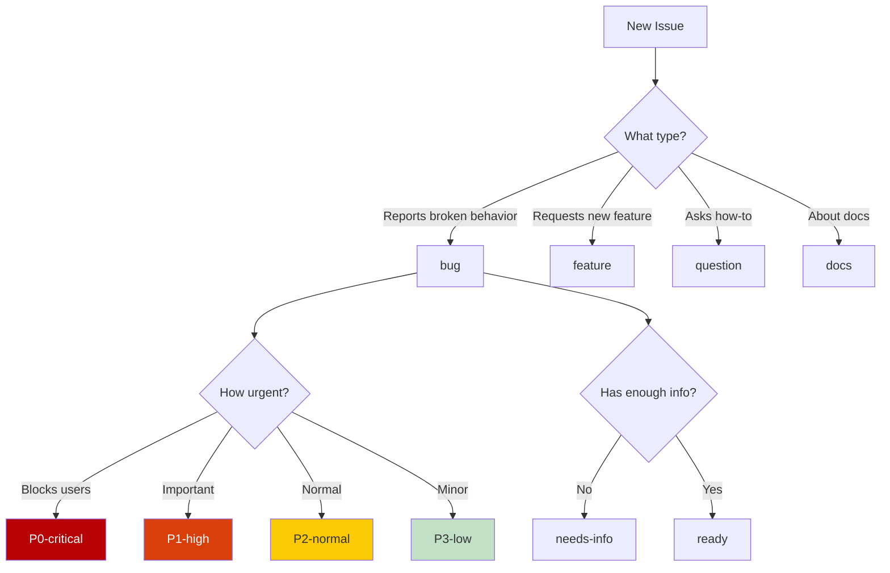

# Task 3.3: Creating Issue and Response Templates with GitHub Copilot

**Duration:** 20 minutes
**Difficulty:** Intermediate
**GitHub Copilot Features:** @workspace, template generation, YAML formatting

## Objective

Use GitHub Copilot to create professional GitHub issue templates, response templates, and automation configurations that improve issue quality and reduce maintenance burden—preventing the chaos you just cleaned up.

## Context

Your backlog analysis revealed issues that were:
- Missing critical information (8 issues needed "more info")
- Inconsistently formatted
- Hard to categorize
- Time-consuming to triage

GitHub issue templates solve these problems by:
- Requiring specific information upfront
- Providing consistent structure
- Enabling automatic labeling
- Making triage faster

GitHub Copilot can generate:
- GitHub issue form templates (YAML)
- Classic markdown templates
- Saved replies for common responses
- Issue configuration files

This task shows you how to prevent future backlog chaos with good templates.

## Setup

1. **Review your previous analysis:**
   - `issue-analysis.md` (what info was missing)
   - `issue-relationships.md` (common patterns)

2. **Open Copilot Chat:** `Ctrl+Shift+I` (Cmd+Shift+I on Mac)

3. **Create templates directory:**
   ```bash
   mkdir -p .github/ISSUE_TEMPLATE
   ```

## Tasks

### 1. Generate Bug Report Template

**GitHub Copilot Chat Prompt:**

```
@workspace Based on the issues I analyzed (which had missing information), create a GitHub issue form template for bug reports.

The template should:
1. Use GitHub's YAML form syntax (not markdown)
2. Require essential information we found was often missing:
   - Description of the problem
   - Steps to reproduce
   - Expected vs actual behavior
   - Environment (OS, version, Python version)
   - Error messages/logs
3. Include helpful hints and examples
4. Auto-label as "bug" and "needs-triage"
5. Make required fields actually required
6. Use appropriate input types (textarea, dropdown, checkboxes)

File path: .github/ISSUE_TEMPLATE/bug_report.yml

Make it friendly and helpful, not intimidating.
```

**What Copilot Does:**
- Generates proper YAML structure
- Uses GitHub's form syntax
- Creates required vs optional fields
- Includes helpful placeholders
- Adds auto-labeling

**Follow-up to Refine:**

```
@workspace Add a dropdown for priority (P0-P3) so reporters can indicate urgency
```

```
@workspace Add a checkbox asking if they searched existing issues first
```

**Deliverable:** Save as `.github/ISSUE_TEMPLATE/bug_report.yml`

---

### 2. Generate Feature Request Template

**GitHub Copilot Chat Prompt:**

```
@workspace Create a GitHub issue form template for feature requests.

Include fields for:
1. **Problem to solve:** What problem does this feature address?
2. **Proposed solution:** How should it work?
3. **Alternatives considered:** What other approaches did they think about?
4. **Use case:** Real-world scenario where this would help
5. **Impact:** Who benefits? How many users?
6. **Willingness to contribute:** Would they help implement it?

Requirements:
- YAML form syntax
- Auto-label as "feature" and "needs-triage"
- Make problem description and proposed solution required
- Use dropdowns for impact (low/medium/high)
- Include helpful examples in placeholders

File: .github/ISSUE_TEMPLATE/feature_request.yml
```

**What Copilot Does:**
- Creates structured feature request form
- Requires key information
- Helps assess value/impact
- Identifies potential contributors

**Deliverable:** Save as `.github/ISSUE_TEMPLATE/feature_request.yml`

---

### 3. Generate Documentation Issue Template

**GitHub Copilot Chat Prompt:**

```
@workspace Create a GitHub issue form template specifically for documentation issues.

Based on our analysis, doc issues include:
- Typos and errors
- Unclear instructions
- Missing information
- Broken links
- Outdated content

Fields needed:
1. **Issue type:** Dropdown (typo, unclear, missing, broken link, outdated, other)
2. **Location:** Where in the docs (file path or URL)
3. **Current content:** What it says now
4. **Problem:** What's wrong with it
5. **Suggested fix:** How to improve it (optional)
6. **Additional context:** Screenshots, etc. (optional)

Auto-label as "docs" and "needs-triage"

File: .github/ISSUE_TEMPLATE/documentation.yml
```

**What Copilot Does:**
- Creates docs-specific template
- Categorizes doc issue types
- Requires location information
- Makes fixes easier with current/suggested content

**Deliverable:** Save as `.github/ISSUE_TEMPLATE/documentation.yml`

---

### 4. Generate Question Template

**GitHub Copilot Chat Prompt:**

```
@workspace Create a GitHub issue form template for questions and support requests.

Many issues in our backlog were actually questions (e.g., "how do I...").

Fields:
1. **What are you trying to do?** (required)
2. **What have you tried?** (required)
3. **Where did you look for answers?** (docs, GitHub, etc.)
4. **Environment:** OS, version (optional)
5. **Additional context:** (optional)

Include:
- Friendly tone (questions are welcome!)
- Links to documentation
- Suggestion to check FAQ first
- Auto-label as "question" and "support"

Also include a note: "For general discussion, consider GitHub Discussions instead of issues"

File: .github/ISSUE_TEMPLATE/question.yml
```

**What Copilot Does:**
- Creates welcoming question template
- Encourages self-service first
- Gathers useful context
- Directs to appropriate channels

**Deliverable:** Save as `.github/ISSUE_TEMPLATE/question.yml`

---

### 5. Create Template Configuration File

**GitHub Copilot Chat Prompt:**

```
@workspace Create the GitHub issue template config file that:

1. Customizes the "New Issue" page
2. Adds a blank issue option for edge cases
3. Links to external resources:
   - Documentation: https://docs.example.com
   - Discussions: Link to GitHub Discussions
   - Security issues: Link to security policy

File: .github/ISSUE_TEMPLATE/config.yml

Use proper GitHub config.yml syntax.
```

**What Copilot Does:**
- Generates config.yml
- Customizes issue creation experience
- Adds helpful links
- Enables blank issue option

**Deliverable:** Save as `.github/ISSUE_TEMPLATE/config.yml`

---

### 6. Generate Saved Replies for Common Responses

**GitHub Copilot Chat Prompt:**

```
@workspace Based on our backlog analysis, generate saved reply templates for common scenarios.

Create templates for:

1. **Requesting more information:**
   - When issue is vague
   - Polite, specific about what's needed
   - Template format for GitHub saved replies

2. **Closing as duplicate:**
   - Thanks reporter
   - Links to original issue
   - Invites them to add info there

3. **Closing as won't fix:**
   - Explains why (with kindness)
   - Suggests alternatives if applicable
   - Leaves door open for discussion

4. **Closing as needs discussion:**
   - Invites to GitHub Discussions
   - Explains why discussion better than issue
   - Provides discussion link

5. **Asking for reproduction:**
   - Politely requests minimal reproduction
   - Explains why it's helpful
   - Offers to help create one

6. **Welcoming first contribution:**
   - Thanks for interest
   - Links to contributor guide
   - Offers mentorship

Each template should be:
- Friendly and professional
- Copy-paste ready
- Customizable (uses placeholders like {issue-number})
```

**What Copilot Does:**
- Creates professional response templates
- Maintains consistent tone
- Saves time on common responses
- Keeps interactions positive

**Deliverable:** Create `saved-replies.md` with all templates

---

### 7. Create Issue Labeling Guide

**GitHub Copilot Chat Prompt:**

```
@workspace Create a labeling guide document that explains:

1. All labels we should have (from our analysis):
   - Type labels (bug, feature, docs, question)
   - Priority labels (P0-P3)
   - Status labels (needs-info, duplicate, ready)
   - Component labels (api, cli, docs, installer)

2. For each label:
   - Name
   - Color code (hex)
   - Description
   - When to use it
   - Example issues

3. Labeling decision tree:
   - "If the issue is X, label it Y"
   - Flowchart in Mermaid format

4. GitHub CLI commands to create all labels

This helps maintainers label consistently.

File: LABELING_GUIDE.md
```

**What Copilot Does:**
- Documents complete label system
- Provides clear guidelines
- Creates decision flowchart
- Includes setup commands

**Deliverable:** Save as `LABELING_GUIDE.md`

---

### 8. Generate Auto-Labeling Workflow

**GitHub Copilot Chat Prompt:**

```
@workspace Create a GitHub Actions workflow that automatically labels issues based on content.

The workflow should:
1. Trigger on issue creation/editing
2. Auto-label based on keywords:
   - "bug", "error", "crash" → add "bug" label
   - "feature", "request", "enhancement" → add "feature" label
   - "docs", "documentation", "typo" → add "docs" label
   - "how to", "question" → add "question" label
3. Auto-label based on title patterns
4. Add "needs-triage" to all new issues
5. Comment with welcome message on first-time issues

Use proper GitHub Actions YAML syntax.

File: .github/workflows/issue-labeler.yml
```

**What Copilot Does:**
- Generates GitHub Actions workflow
- Uses keyword detection
- Automates basic triage
- Welcomes new contributors

**Alternative - Simple Approach:**

```
@workspace Actually, let's use GitHub's built-in issue labeler action. Create the configuration for that instead.

File: .github/labeler.yml
```

**Deliverable:** Save as `.github/workflows/issue-labeler.yml` or `.github/labeler.yml`

---

## Output Format

Your template files should be organized like this:

### Bug Report Template (.github/ISSUE_TEMPLATE/bug_report.yml)

```yaml
name: Bug Report
description: Report a bug or unexpected behavior
title: "[Bug]: "
labels: ["bug", "needs-triage"]
body:
  - type: markdown
    attributes:
      value: |
        Thanks for taking the time to report a bug! Please fill out the information below to help us fix it quickly.

  - type: checkboxes
    id: prerequisites
    attributes:
      label: Prerequisites
      description: Please confirm before submitting
      options:
        - label: I have searched existing issues to make sure this isn't a duplicate
          required: true
        - label: I have checked the documentation
          required: true

  - type: textarea
    id: description
    attributes:
      label: Bug Description
      description: A clear description of what the bug is
      placeholder: "Example: When I try to install on Windows, the installer crashes with error..."
    validations:
      required: true

  - type: textarea
    id: reproduce
    attributes:
      label: Steps to Reproduce
      description: Step-by-step instructions to reproduce the issue
      placeholder: |
        1. Install on Windows 11
        2. Run command: techflow install
        3. See error message
    validations:
      required: true

  - type: textarea
    id: expected
    attributes:
      label: Expected Behavior
      description: What did you expect to happen?
      placeholder: "Installation should complete successfully"
    validations:
      required: true

  - type: textarea
    id: actual
    attributes:
      label: Actual Behavior
      description: What actually happened?
      placeholder: "Installation crashes with error: ..."
    validations:
      required: true

  - type: dropdown
    id: os
    attributes:
      label: Operating System
      options:
        - Windows 10
        - Windows 11
        - macOS (Intel)
        - macOS (Apple Silicon)
        - Linux (Ubuntu)
        - Linux (Other)
        - Other
    validations:
      required: true

  - type: input
    id: version
    attributes:
      label: Version
      description: What version of our software are you using?
      placeholder: "2.1.0"
    validations:
      required: true

  - type: input
    id: python-version
    attributes:
      label: Python Version
      description: What version of Python?
      placeholder: "3.10.5"
    validations:
      required: false

  - type: textarea
    id: logs
    attributes:
      label: Error Messages / Logs
      description: Copy and paste any error messages or logs
      render: shell
      placeholder: |
        ERROR: Installation failed
        Traceback (most recent call last):
        ...

  - type: dropdown
    id: priority
    attributes:
      label: Priority
      description: How urgent is this?
      options:
        - P0 - Critical (blocking my work)
        - P1 - High (important but can work around)
        - P2 - Normal (standard priority)
        - P3 - Low (nice to have)
    validations:
      required: false

  - type: textarea
    id: additional
    attributes:
      label: Additional Context
      description: Anything else that might be relevant (screenshots, environment details, etc.)
      placeholder: "I'm using PowerShell on Windows 11 Pro..."
    validations:
      required: false
```

### Feature Request Template (.github/ISSUE_TEMPLATE/feature_request.yml)

```yaml
name: Feature Request
description: Suggest a new feature or enhancement
title: "[Feature]: "
labels: ["feature", "needs-triage"]
body:
  - type: markdown
    attributes:
      value: |
        Thanks for suggesting a feature! Help us understand your idea by filling out the details below.

  - type: checkboxes
    id: prerequisites
    attributes:
      label: Prerequisites
      options:
        - label: I have searched existing issues to make sure this isn't a duplicate
          required: true

  - type: textarea
    id: problem
    attributes:
      label: Problem to Solve
      description: What problem does this feature address?
      placeholder: "Currently, users can't easily... This makes it difficult to..."
    validations:
      required: true

  - type: textarea
    id: solution
    attributes:
      label: Proposed Solution
      description: How should this feature work?
      placeholder: "Add a new command 'techflow sync' that automatically..."
    validations:
      required: true

  - type: textarea
    id: alternatives
    attributes:
      label: Alternatives Considered
      description: What other approaches have you thought about?
      placeholder: "I considered using... but that doesn't work because..."
    validations:
      required: false

  - type: textarea
    id: use-case
    attributes:
      label: Use Case
      description: Describe a real-world scenario where you'd use this
      placeholder: |
        As a developer, I need to sync my local environment with the cloud daily.
        This feature would let me...
    validations:
      required: true

  - type: dropdown
    id: impact
    attributes:
      label: Impact
      description: Who would benefit from this feature?
      options:
        - High - Many users would benefit
        - Medium - Some users would benefit
        - Low - Few users would benefit
    validations:
      required: false

  - type: checkboxes
    id: contribution
    attributes:
      label: Contribution
      description: Would you be willing to help implement this?
      options:
        - label: I'd be willing to submit a PR with guidance
        - label: I can help test the implementation
        - label: I can help with documentation

  - type: textarea
    id: additional
    attributes:
      label: Additional Context
      description: Mockups, examples, or any other relevant information
    validations:
      required: false
```

### Documentation Template (.github/ISSUE_TEMPLATE/documentation.yml)

```yaml
name: Documentation Issue
description: Report an issue with documentation
title: "[Docs]: "
labels: ["docs", "needs-triage"]
body:
  - type: markdown
    attributes:
      value: |
        Thanks for helping improve our documentation!

  - type: dropdown
    id: issue-type
    attributes:
      label: Issue Type
      description: What kind of documentation issue is this?
      options:
        - Typo or grammar error
        - Unclear instructions
        - Missing information
        - Broken link
        - Outdated content
        - Code example doesn't work
        - Other
    validations:
      required: true

  - type: input
    id: location
    attributes:
      label: Location
      description: Where is this issue? (file path or URL)
      placeholder: "docs/getting-started.md or https://docs.example.com/api"
    validations:
      required: true

  - type: textarea
    id: current
    attributes:
      label: Current Content
      description: What does the documentation say now?
      placeholder: "Quote the current text or describe what's there"
    validations:
      required: true

  - type: textarea
    id: problem
    attributes:
      label: What's Wrong
      description: Explain the problem
      placeholder: "This instruction doesn't work on Windows because..."
    validations:
      required: true

  - type: textarea
    id: suggested
    attributes:
      label: Suggested Fix
      description: How should it be fixed? (optional but helpful!)
      placeholder: "It should say... or include this example..."
    validations:
      required: false

  - type: textarea
    id: additional
    attributes:
      label: Additional Context
      description: Screenshots, error messages, etc.
    validations:
      required: false
```

### Question Template (.github/ISSUE_TEMPLATE/question.yml)

```yaml
name: Question / Help
description: Ask a question or get help using the tool
title: "[Question]: "
labels: ["question", "support"]
body:
  - type: markdown
    attributes:
      value: |
        👋 Thanks for asking a question!

        **Before submitting:**
        - Check the [documentation](https://docs.example.com)
        - Search [existing issues](../issues) for similar questions
        - Check [GitHub Discussions](../discussions) for Q&A

        **Note:** For general discussion, please use GitHub Discussions instead of issues.

  - type: textarea
    id: question
    attributes:
      label: Your Question
      description: What are you trying to do or understand?
      placeholder: "How do I configure automatic backups in TechFlow?"
    validations:
      required: true

  - type: textarea
    id: tried
    attributes:
      label: What Have You Tried?
      description: What approaches have you already attempted?
      placeholder: |
        I tried:
        1. Running techflow backup --auto
        2. Checking the config file
        But I'm not sure how to...
    validations:
      required: true

  - type: checkboxes
    id: research
    attributes:
      label: Where Have You Looked?
      description: Help us understand where you've already searched
      options:
        - label: Documentation
        - label: GitHub Issues
        - label: GitHub Discussions
        - label: Web search

  - type: input
    id: os
    attributes:
      label: Operating System (if relevant)
      placeholder: "Windows 11"

  - type: input
    id: version
    attributes:
      label: Version (if relevant)
      placeholder: "2.1.0"

  - type: textarea
    id: additional
    attributes:
      label: Additional Context
      description: Anything else that might help
    validations:
      required: false
```

### Config File (.github/ISSUE_TEMPLATE/config.yml)

```yaml
blank_issues_enabled: true
contact_links:
  - name: 📚 Documentation
    url: https://docs.example.com
    about: Check our comprehensive documentation
  - name: 💬 GitHub Discussions
    url: https://github.com/owner/repo/discussions
    about: For general questions and discussions, use Discussions instead of Issues
  - name: 🔒 Security Vulnerability
    url: https://github.com/owner/repo/security/policy
    about: Please report security vulnerabilities through our security policy
  - name: 💡 Feature Discussions
    url: https://github.com/owner/repo/discussions/categories/ideas
    about: Discuss and vote on feature ideas
```

### Saved Replies (saved-replies.md)

```markdown
# GitHub Saved Reply Templates

Copy these to GitHub Settings > Saved Replies for quick responses.

---

## Template: Request More Information

**Name:** request-more-info

**Comment:**
```
Thanks for reporting this, @{username}!

To help us investigate, could you please provide:

- [ ] Steps to reproduce the issue
- [ ] What you expected to happen
- [ ] What actually happened
- [ ] Your environment (OS, version, Python version)
- [ ] Any error messages or logs

The more detail you can provide, the faster we can fix this! 🙏
```

---

## Template: Close as Duplicate

**Name:** close-duplicate

**Comment:**
```
Thanks for reporting this, @{username}!

This is a duplicate of #{original-issue-number}, where the same issue is being tracked with more detail.

I'm closing this to keep the discussion in one place, but **please add any additional information you have to #{original-issue-number}**—especially if your symptoms or environment are different!

We appreciate you taking the time to report this. 👍
```

---

## Template: Close as Won't Fix

**Name:** close-wont-fix

**Comment:**
```
Thanks for the suggestion, @{username}!

After discussing this with the team, we've decided not to implement this feature because {reason}.

However, you might be interested in {alternative-approach-or-tool}.

We appreciate your input and understand this might be disappointing. If you'd like to discuss this further, please feel free to open a discussion in [GitHub Discussions](link). We're always open to reconsidering based on new information or changing circumstances.

Thanks for your understanding! 🙏
```

---

## Template: Move to Discussions

**Name:** move-to-discussions

**Comment:**
```
Thanks for opening this, @{username}!

This is a great topic for discussion, but issues are better suited for tracking bugs and specific feature requests. I'm going to close this and suggest continuing the conversation in [GitHub Discussions](link).

I've created a discussion here: {discussion-link}

Looking forward to hearing your thoughts there! 💬
```

---

## Template: Request Reproduction

**Name:** request-reproduction

**Comment:**
```
Thanks for the report, @{username}!

To help us fix this, could you provide a minimal reproduction? This means:

1. The smallest possible code/steps that demonstrate the issue
2. No extra dependencies or setup if possible
3. Clear instructions on how to run it

**Example:**
```
# Install
pip install techflow==2.1.0

# Run this command
techflow sync --config minimal.yml

# See this error
ERROR: ...
```

A minimal reproduction helps us:
- Identify the exact cause faster
- Write a test to prevent regression
- Verify the fix works

Happy to help create one if you're not sure how! Just share what you're seeing and we can work together on it. 🤝
```

---

## Template: Welcome First-Time Contributor

**Name:** welcome-first-time

**Comment:**
```
Welcome, @{username}! 👋

Thank you for your interest in contributing to this project! This is wonderful to see.

Before you get started:
- Check out our [Contributing Guide](CONTRIBUTING.md)
- Read our [Code of Conduct](CODE_OF_CONDUCT.md)
- Join our [Discord/Slack/Community] if you have questions

For this specific issue:
- {specific-guidance-for-this-issue}

Don't hesitate to ask questions—we're here to help! Looking forward to working with you. 🎉
```

---

## Template: Thank Maintainer for Contribution

**Name:** thank-contributor

**Comment:**
```
Merged! Thank you for this contribution, @{username}! 🎉

Your {description-of-contribution} makes the project better for everyone. We really appreciate you taking the time to:
- {what-they-did-well}

Looking forward to more contributions from you! 🚀
```

---

## Template: Stale Issue Check

**Name:** stale-check

**Comment:**
```
Hi @{username}!

We haven't heard back on this issue in {time-period}. We're doing some cleanup and want to make sure we're working on the most relevant issues.

**Are you still experiencing this?** If so, please let us know and we'll keep this open.

If we don't hear back in 7 days, we'll close this to keep the issue tracker organized. You can always reopen it later if needed!

Thanks! 🙏
```

---
```

### Labeling Guide (LABELING_GUIDE.md)

```markdown
# Issue Labeling Guide

This guide helps maintainers label issues consistently.

---

## Label Categories

### Type Labels

| Label | Color | Description | When to Use | Example |
|-------|-------|-------------|-------------|---------|
| `bug` | `#d73a4a` | Something isn't working | Issue reports unexpected behavior, errors, crashes | "Installation fails on Windows" |
| `feature` | `#0075ca` | New feature request | Issue requests new functionality | "Add dark mode support" |
| `enhancement` | `#a2eeef` | Improvement to existing feature | Issue requests improvement to something that already exists | "Make error messages clearer" |
| `docs` | `#0075ca` | Documentation issue | Issue is about docs (typos, missing info, unclear) | "Typo in getting started guide" |
| `question` | `#d876e3` | Question or support request | Issue is asking how to do something | "How do I configure backups?" |
| `discussion` | `#cc317c` | Needs discussion | Issue needs community input before action | "Should we support Python 2.7?" |

### Priority Labels

| Label | Color | Description | When to Use |
|-------|-------|-------------|-------------|
| `P0-critical` | `#b60205` | Critical, needs immediate fix | Blocks users, security issue, data loss, docs site down |
| `P1-high` | `#d93f0b` | Important, fix soon | Affects many users, broken core feature |
| `P2-normal` | `#fbca04` | Standard priority | Standard bug or feature, normal schedule |
| `P3-low` | `#c2e0c6` | Nice to have | Minor issue, edge case, cosmetic |

### Status Labels

| Label | Color | Description | When to Use |
|-------|-------|-------------|-------------|
| `needs-info` | `#d876e3` | Waiting for more information | Issue is vague or missing key details |
| `needs-triage` | `#ededed` | Needs initial review | Automatically added to new issues |
| `duplicate` | `#cfd3d7` | Duplicate of another issue | Same as existing issue |
| `wont-fix` | `#ffffff` | Will not be fixed/implemented | Decided not to do this |
| `ready` | `#0e8a16` | Ready to work on | Issue is clear, approved, ready for implementation |
| `in-progress` | `#fbca04` | Being worked on | Someone is actively working on this |
| `blocked` | `#b60205` | Blocked by something else | Can't proceed until another issue is resolved |

### Component Labels

| Label | Color | Description |
|-------|-------|-------------|
| `api` | `#1d76db` | API related |
| `cli` | `#1d76db` | Command line interface |
| `docs` | `#0075ca` | Documentation site |
| `installer` | `#1d76db` | Installation process |
| `windows` | `#5319e7` | Windows-specific |
| `macos` | `#5319e7` | macOS-specific |
| `linux` | `#5319e7` | Linux-specific |

---

## Labeling Decision Tree



---

## Quick Reference

**Bug with good info:**
- `bug`, `P2-normal`, `ready`, `[component]`

**Urgent bug:**
- `bug`, `P0-critical`, `ready`, `[component]`

**Vague bug report:**
- `bug`, `needs-info`, `needs-triage`

**Feature request:**
- `feature`, `P2-normal`, `needs-triage`

**Documentation typo:**
- `docs`, `P2-normal`, `ready` (quick fix!)

**Question:**
- `question`, consider moving to Discussions

**Duplicate:**
- `duplicate`, close with reference to original

---

## Creating Labels via GitHub CLI

```bash
# Type labels
gh label create "bug" --description "Something isn't working" --color d73a4a
gh label create "feature" --description "New feature request" --color 0075ca
gh label create "enhancement" --description "Improvement to existing feature" --color a2eeef
gh label create "docs" --description "Documentation issue" --color 0075ca
gh label create "question" --description "Question or support request" --color d876e3
gh label create "discussion" --description "Needs discussion" --color cc317c

# Priority labels
gh label create "P0-critical" --description "Critical, needs immediate fix" --color b60205
gh label create "P1-high" --description "Important, fix soon" --color d93f0b
gh label create "P2-normal" --description "Standard priority" --color fbca04
gh label create "P3-low" --description "Nice to have" --color c2e0c6

# Status labels
gh label create "needs-info" --description "Waiting for more information" --color d876e3
gh label create "needs-triage" --description "Needs initial review" --color ededed
gh label create "duplicate" --description "Duplicate of another issue" --color cfd3d7
gh label create "wont-fix" --description "Will not be fixed" --color ffffff
gh label create "ready" --description "Ready to work on" --color 0e8a16
gh label create "in-progress" --description "Being worked on" --color fbca04
gh label create "blocked" --description "Blocked by something" --color b60205

# Component labels
gh label create "api" --description "API related" --color 1d76db
gh label create "cli" --description "CLI related" --color 1d76db
gh label create "installer" --description "Installation process" --color 1d76db
gh label create "windows" --description "Windows-specific" --color 5319e7
gh label create "macos" --description "macOS-specific" --color 5319e7
gh label create "linux" --description "Linux-specific" --color 5319e7
```

---

## Examples

### Example 1: Installation Bug

**Issue:** "Can't install on Windows 11, gets error about paths"

**Labels:**
- `bug` (it's broken)
- `P1-high` (blocks Windows users)
- `installer` (component)
- `windows` (platform)
- `ready` (has enough info)

**Rationale:** Serious bug affecting specific platform, clear reproduction steps.

---

### Example 2: Vague Bug Report

**Issue:** "It doesn't work"

**Labels:**
- `bug` (seems to be a bug)
- `needs-info` (too vague)
- `needs-triage` (needs review)

**Action:** Request more information using saved reply template.

---

### Example 3: Feature Request

**Issue:** "Add support for PostgreSQL database"

**Labels:**
- `feature` (new functionality)
- `P2-normal` (standard priority)
- `needs-triage` (needs discussion on feasibility)

**Rationale:** New feature, needs team review before committing.

---

## Best Practices

1. **Add labels immediately** - Don't let issues sit unlabeled
2. **Use multiple labels** - Combine type + priority + component
3. **Update labels as status changes** - Remove `needs-info` when info is provided
4. **Be consistent** - Follow this guide, don't make up new labels
5. **Use component labels** - Helps filter and assign issues
6. **Prioritize honestly** - Not everything is P0!

---

*Consistent labeling makes triage faster and helps contributors find issues to work on!*
```

---

## GitHub Copilot Tips for This Task

### Generating YAML Templates

**Use @workspace for consistency:**

```
@workspace Create a GitHub issue form template matching the style and fields of the existing templates
```

### Getting Proper Syntax

**Ask Copilot about syntax:**

```
@workspace What's the correct YAML syntax for GitHub issue form dropdown fields?
```

### Creating Saved Replies

**Generate multiple variations:**

```
@workspace Create 5 different polite ways to request more information from an issue reporter
```

### Refining Templates

**Iterate and improve:**

```
@workspace Add a helpful hint/placeholder to each field in this template
@workspace Make this template more friendly and less intimidating
```

---

## Success Criteria

You've completed this task when you:

- ✅ Created bug report template (YAML)
- ✅ Created feature request template (YAML)
- ✅ Created documentation issue template (YAML)
- ✅ Created question template (YAML)
- ✅ Created template config file
- ✅ Generated saved reply templates
- ✅ Created labeling guide with decision tree
- ✅ Optionally: Created auto-labeling workflow

---

## Time Management

- **Minutes 0-5:** Generate bug and feature templates
- **Minutes 6-10:** Create docs and question templates
- **Minutes 11-13:** Create config and saved replies
- **Minutes 14-17:** Generate labeling guide
- **Minutes 18-20:** Review and refine all templates

---

## What's Next?

After creating templates to prevent future chaos, move to **Task 3.4** where you'll use GitHub Copilot's **issue-to-PR workflow**—the most powerful feature—to automatically fix simple issues!

---

Ready to continue? Move to **[Task 2.4: Automated Fixes](task-2.4-automated-fixes.md)** to learn how to automatically fix simple issues using GitHub Copilot!
